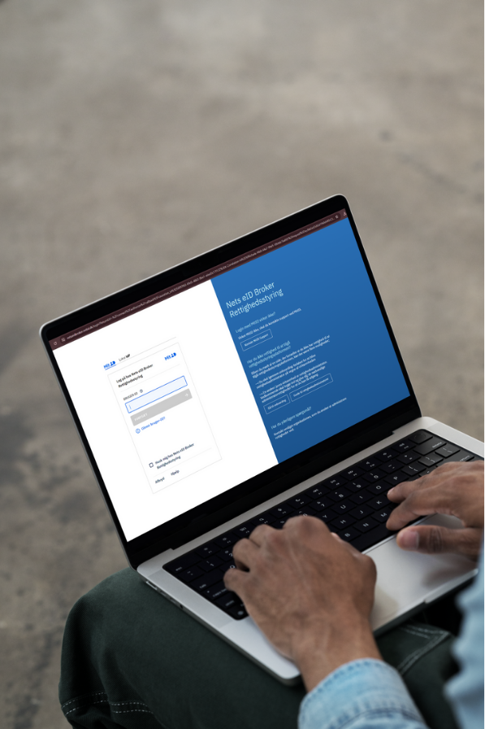

# Signaturgruppen Privilege Management

**Nets eID Broker Privilege Management serves as a platform for administering privileges for your organization.**

Similar to how you can assign specific privileges to employees in business administration for MitID Business, the functionality of Nets eID Broker Privilege Management extends to service providers. These providers may include private services such as insurance companies, pension funds, and others, as well as selected public services like foundations and agencies.

To access a service provider's platform, it is crucial to be configured with the necessary access privileges in advance. This is done to safeguard against unauthorized access to sensitive information about your organization's contractual agreements.

Through the Nets eID Broker Privilege Management platform, you can search for and allocate specific privileges to your employees' MitID Business users.

If you are the privilege administrator, you bear the responsibility for assigning and managing privileges for employees and any external business partners requiring access to digital services from the service provider you are a customer of.

The service provider creates and makes necessary privileges available in the Nets eID Broker Privilege Management administration portal, and it is free for your organization to allocate and use these privileges.

