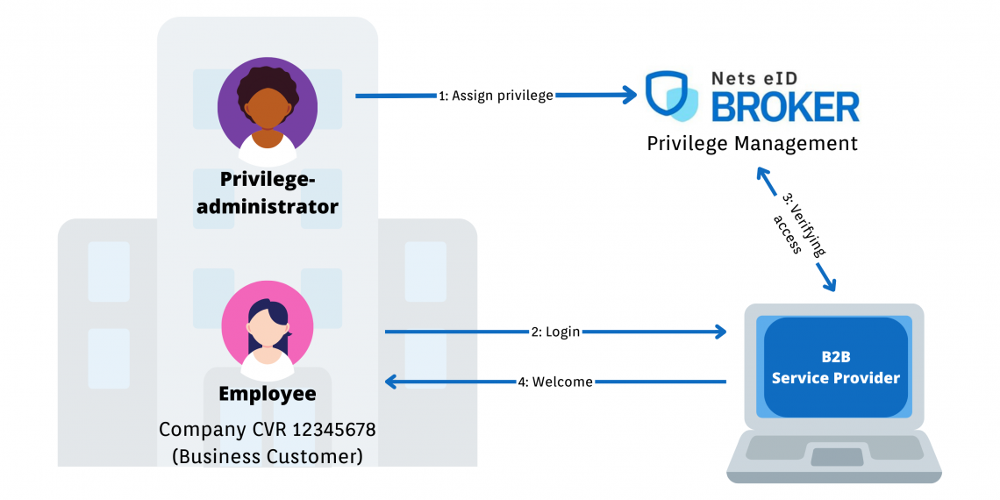

# Signaturgruppen Privilege Management

**Signaturgruppen Privilege Management helps service providers and their customers manage privileges for employees with MitID Erhverv**
 
If you are a MitID service provider and have business customers who need to access your digital services using MitID Erhverv - then you can benefit from Nets eID Broker Privilege Management.

By using Nets eID Broker Privilege Management, you as a service provider can implement access control in your own digital services. In this way, you can help your customers to ensure that only employees with the necessary privilege, connected to their MitID Erhverv, can access your digital services.

It is the service provider that creates the necessary privileges in Nets eID Broker Privilege Management admin-portal. The customers can then assign these privileges to their employees' MitID Erhverv, also from Nets eID Broker Privilege Management admin-portal. This can be done via a web interface and via a programmable API, so that business customers can automate privilege management based on their own directory.

It is free for business customers to assign the privileges and use them. The service provider pays for the establishment and operation of Nets eID Broker Privilege Management.

Nets eID Broker Privilege Management requires a Nets eID Broker contract.

## Example of a use case for Nets eID Broker Privilege Management
An employee must report pension data to a pension company on behalf of his organization.

The pension company makes a privilege available via Nets eID Broker Privilege Management admin-portal, which could be called "Pension Reporter". The organization’s privilege administrator then assigns this privilege to the employee's MitID Erhverv. When the employee accesses the pension company's digital service to report pension data with his/hers MitID Erhverv, the pension company can check that the necessary privilege is assigned for the employee. If this is the case, access is granted to report pension on behalf of the organization in question.

 

## Not already a customer?
Contact us to hear more on 70 25 64 25 or at salg@signaturgruppen.dk.

## Are you already a customer?
See our guide to how your business customers are onboarded and use Nets eID Broker Privilege Management. Download the guide [here](https://broker.signaturgruppen.dk/download_file/view/c4179dbc-1632-49cb-83fd-09e81dc61abe/368).
